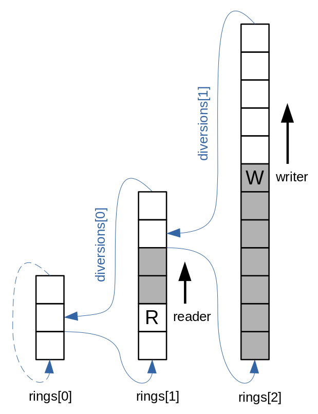

# Multi-Array Queue

A new Queue data structure that inherits the positive properties of array-based Queues
while removing their main drawback: a fixed size.

The Queue is backed by arrays of Objects with exponentially growing sizes, of which all are in use,
but only the first one (with initialCapacity) is allocated up-front.

A detailed description is given in [Paper](Paper_MultiArrayQueue.pdf).
Performance figures are in the Paper as well.

### Interactive Simulator

[Get acquainted with the new Queue here](Simulator_MultiArrayQueue.html)

## Program codes

[Repository](https://github.com/MultiArrayQueue/MultiArrayQueue)

